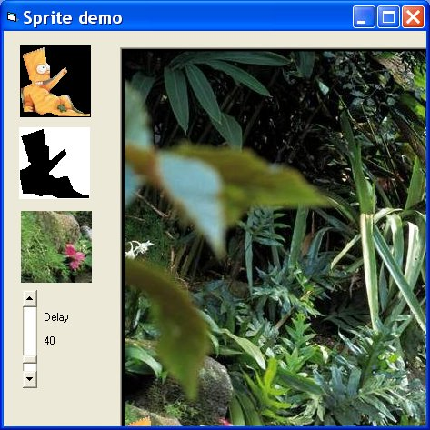



## Basic Sprite Demo

### Description

Basic Sprite Demo by Robert Rayment. I used this to check the extractions from Region Selector (CodeId=64090). Might be instructive to a beginner. Since all the picture boxes are Autosize = True any images, masks &amp; background picture can be loaded in when in the IDE. However, makes use of the VBSpeed timing class which allows smoother time steps than the VB Timer. Zip 174KB.
 
### More Info
 
Just run

             |
---                |---
**Submitted On**   |2005-06-05 16:25:30
**By**             |[Robert Rayment](https://github.com/Planet-Source-Code/PSCIndex/blob/master/ByAuthor/robert-rayment.md)
**Level**          |Beginner
**User Rating**    |5.0 (10 globes from 2 users)
**Compatibility**  |VB 6\.0
**Category**       |[Graphics](https://github.com/Planet-Source-Code/PSCIndex/blob/master/ByCategory/graphics__1-46.md)
**World**          |[Visual Basic](https://github.com/Planet-Source-Code/PSCIndex/blob/master/ByWorld/visual-basic.md)
**Archive File**   |[Basic\_Spri189739652005\.zip](https://github.com/Planet-Source-Code/robert-rayment-basic-sprite-demo__1-60925/archive/master.zip)

### API Declarations

BitBlt

